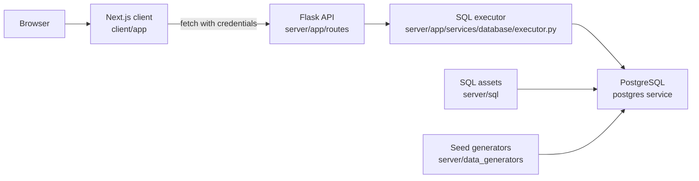

# Architecture

CEFER Management is a medium-to-large archived full-stack application with three main runtime layers:

- A Next.js frontend in `client/`.
- A Flask API in `server/app/`.
- A PostgreSQL database managed through SQL files in `server/sql/`.

Docker Compose connects those layers for local use.

## Frontend Layer

The frontend is a Next.js App Router application under `client/app/`.

Major route areas:

- `client/app/auth/`: login, external login, registration, pending registration review, password change, logout.
- `client/app/admin/`: admin dashboard and management screens.
- `client/app/internal/`: internal user dashboard, activities, installations, invites, and reservations.
- `client/app/staff/`: staff dashboards, activities, participants, resources, reservations, active reservations.
- `client/app/external/`: external invite dashboard.
- `client/app/reports/`: analytical report overview.

Shared client responsibilities:

- `client/lib/api.ts`: typed HTTP helpers using `credentials: "include"`.
- `client/lib/auth.ts`: current-user lookup and role helpers.
- `client/lib/authStore.ts`: Zustand-backed auth state.
- `client/lib/queryClient.tsx`: TanStack Query provider.
- `client/components/ProtectedRoute.tsx`: client-side route protection and role redirects.
- `client/hooks/`: domain-specific query and mutation hooks.

The frontend gets the API base URL from `NEXT_PUBLIC_API_URL` through `client/lib/utils.ts`.

## Backend Layer

The Flask application uses an app factory in `server/app/__init__.py`:

1. Create a `Flask` instance.
2. Load `AppConfig` from `server/app/config.py`.
3. Register extensions in `server/app/extensions.py`.
4. Register blueprints in `server/app/routes/__init__.py`.

Route groups:

- `auth_blueprint`: `/auth`
- `admin_blueprint`: `/admin`
- `internal_blueprint`: `/internal`
- `staff_blueprint`: `/staff`
- `external_blueprint`: `/external`
- `extension_group_blueprint`: `/extension_group`
- `reports_blueprint`: `/reports`
- `views_blueprint`: `/views`
- `debug_blueprint`: `/debug`
- `home_blueprint`: `/`

Every normal request creates a `DBSession` in `server/app/extensions.py`. The same hook also calls `ensure_schema_populated()` to make sure the schema and database assets exist before handling non-debug requests.

## Database Layer

PostgreSQL is the source of truth. The backend keeps SQL separate from route code:

- `server/sql/upgrade_schema.sql`: tables and constraints.
- `server/sql/functions/`: PL/pgSQL functions and triggers.
- `server/sql/indexes.sql`: explicit indexes.
- `server/sql/views.sql`: database views used by reporting/table APIs.
- `server/sql/queries/`: route-level query files grouped by domain.
- `server/sql/downgrades/` and `server/sql/downgrade_schema.sql`: cleanup/downgrade assets.

Routes normally call the SQL executor in `server/app/services/database/executor.py`, which loads SQL files from `server/sql/queries/`, executes them through the request database session, and serializes date/time values for JSON responses.

## Bootstrap And Seed Flow

Database bootstrap exists in two places:

- Request-time bootstrap in `server/app/services/database/bootstrap.py`.
- Container startup population in `server/docker/entrypoint.py`.

The bootstrap flow applies:

1. `server/sql/upgrade_schema.sql`
2. SQL functions and triggers from `server/sql/functions/`
3. `server/sql/indexes.sql`
4. `server/sql/views.sql`
5. Synthetic data from `server/data_generators/populate.py`

The Docker entrypoint only runs population automatically when `POPULATE_DB=true`.

## Authentication And Authorization

The application uses Flask sessions:

- Internal users authenticate through `/auth/login`.
- External users authenticate through `/auth/login/external` with an invitation token.
- Session data stores user identity and role access.
- `server/app/services/auth/decorators.py` provides `require_auth`, `require_role`, and `require_external_auth`.
- The frontend mirrors role checks through `ProtectedRoute` and `client/lib/auth.ts`.

## Current Architectural Limitations

- There is no identified automated test suite.
- There is no identified production deployment pipeline.
- Some debug logging and debug database routes exist in the backend.
- Database bootstrap is coupled to request handling, so database availability affects route handling directly.
- Historical academic artifacts are mixed into the repository alongside operational docs.
